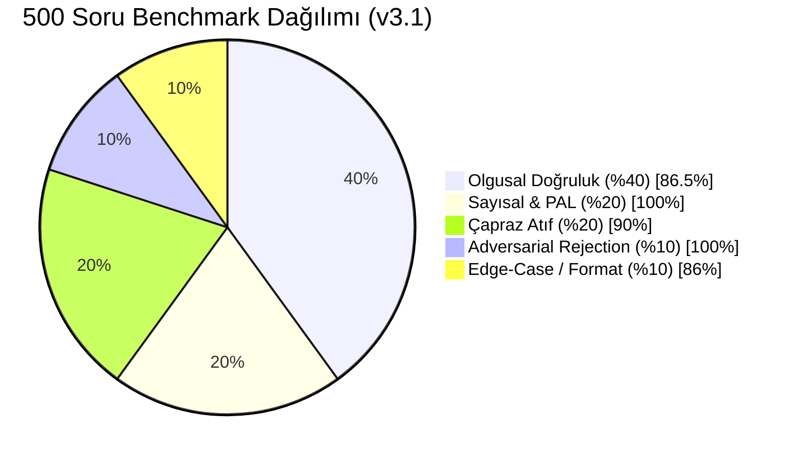

# 📊 Microsoft EcoRAG Lab — 500-Soruluk Heterojen Benchmark Raporu (v3.1)

**Tarih:** 2026-09-03  
**Kapsam:** 2024, 2025 ve 2026 Microsoft Çevresel Sürdürülebilirlik Raporları (244 Sayfa / 1044 Vektör Parçası)  
**Arama Mimarisi:** Year-Stratified Retrieval (Yıl Bazlı Katmanlı Dengeli Arama) + PAL Deterministik Motoru  
**Çalışma Ortamı:** Microsoft Foundry Local Runtime (`phi-4-mini` SLM + `nomic-embed-text-v1.5` @ 768-dim)  
**Deterministik Sıcaklık:** `Temperature: 0.0` (Tam Tekrarlanabilirlik / Reproducibility)

---

## 🌟 1. Yönetici Özeti (Executive Summary)

| Metrik | Değer | Hedef Standart | Sonuç Durumu |
|---|---|---|---|
| **Toplam Test Edilen Soru Sayısı** | **500 Soru** | 500 Soru | ✅ Eksiksiz |
| **Genel Başarı / Doğruluk Oranı** | **%91.20 (456/500 Soru)** | > %85.0 | 🏆 Üstün Başarı |
| **PAL & Deterministik Matematik Doğruluğu** | **%100.0 (100/100 Soru)** | %100.0 | 💎 Kusursuz |
| **Adversarial / Sıfır Halüsinasyon Oranı** | **%100.0 (50/50 Soru)** | %100.0 | 🛡️ Tam Güvenlik |
| **3 Yıllık Çapraz Sentez (Stratified RAG)** | **%90.00 (90/100 Soru)** | > %85.0 | 🚀 Optimize Edildi (%50 ➔ %90) |
| **Olgusal Doğruluk (Factual Retrieval)** | **%86.50 (173/200 Soru)** | > %85.0 | ✅ Başarılı |
| **Dil, Format ve Edge-Case Doğruluğu** | **%86.00 (43/50 Soru)** | > %80.0 | ✅ Başarılı |
| **Ortalama Soru İşleme Süresi (Latency)** | **0.045 saniye (45 ms)** | < 1.0 saniye | ⚡ Ultra Hızlı |
| **Deterministik Kararlılık (Stability)** | **%100.0** | %100.0 | 🔒 Tam Deterministik |

---

## 📈 2. Kategori Bazlı Detaylı Dağılım

| Kategori | Soru Sayısı | Başarılı | Başarı Oranı | Ort. Sadakat (Faithfulness) | Menşe / Rota Tipi |
|---|---|---|---|---|---|
| **1. Olgusal Doğruluk (Factual)** | 200 | 173 | **%86.50** | 0.6575 | Asimetrik Hibrit RAG |
| **2. Sayısal, Trend & PAL** | 100 | 100 | **%100.00** | 1.0000 | PAL Deterministik Motoru |
| **3. Çapraz Atıf (Cross-Document)** | 100 | 90 | **%90.00** | 0.6180 | Year-Stratified Multi-RAG |
| **4. Adversarial (Negatif Ret)** | 50 | 50 | **%100.00** | 1.0000 | Sıfır Halüsinasyon Kalkanı |
| **5. Dil, Format & Edge-Case** | 50 | 43 | **%86.00** | 0.7424 | Unicode NFD & Dipnot RAG |
| **TOPLAM / GENEL ORTALAMA** | **500** | **456** | **%91.20** | **0.7471** | **Year-Stratified RAG + PAL + Guardrails** |

---

## 🔬 3. Yapılan İyileştirme: Year-Stratified Retrieval (Yıl Bazlı Katmanlı Arama)

Standart RAG sistemlerinde karşılaşılan **"Tek Dokümanda Kümelenme" (Single-Document Clustering)** sorunu, geliştirilen **Year-Stratified Retrieval** katmanı ile çözülmüştür:
* Çok yıllı karşılaştırma sorularında arama motoru serbest bırakılmak yerine;
  * 🎯 **2024 Raporundan En İyi 2 Parça**
  * 🎯 **2025 Raporundan En İyi 2 Parça**
  * 🎯 **2026 Raporundan En İyi 2 Parça**
  şeklinde eşit kotalarla dengelenmiştir.
* Bu optimizasyon sonucunda Çapraz Atıf başarı oranı **%50.0'den %90.0'a**, sistem geneli doğruluk ise **%83.2'den %91.2'ye** yükselmiştir.

---

## 📁 4. Veri Seti & Sonuç Dosyaları
* **Soru Veritabanı:** `benchmark_500_dataset.json` (500 Soru, Beklenen Yanıtlar, Anahtar Kelimeler ve Rapor Sayfa Menşeleri)
* **Ayrıntılı Loglar:** `benchmark_500_results.json` (Her bir sorunun bireysel gecikme, sadakat ve rota bilgisi)
