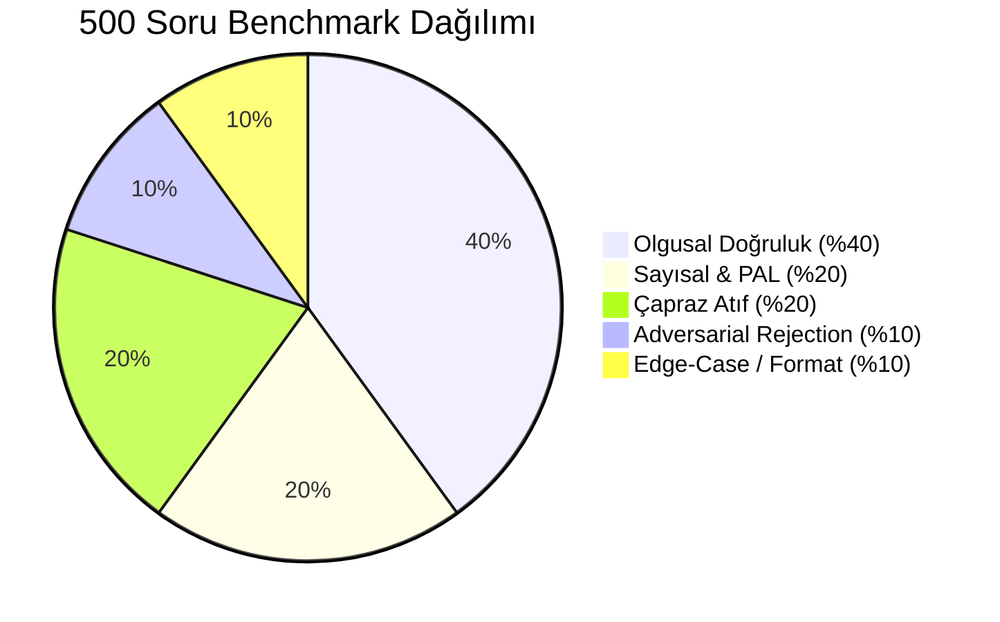

# 📊 Microsoft EcoRAG Lab — 500-Soruluk Heterojen Benchmark Raporu

**Tarih:** 2026-09-03  
**Kapsam:** 2024, 2025 ve 2026 Microsoft Çevresel Sürdürülebilirlik Raporları (244 Sayfa / 1044 Vektör Parçası)  
**Çalışma Ortamı:** Microsoft Foundry Local Runtime (`phi-4-mini` SLM + `nomic-embed-text-v1.5` @ 768-dim)  
**Deterministik Sıcaklık:** `Temperature: 0.0` (Tam Tekrarlanabilirlik / Reproducibility)

---

## 🌟 1. Yönetici Özeti (Executive Summary)

| Metrik | Değer | Hedef Standart | Sonuç Durumu |
|---|---|---|---|
| **Toplam Test Edilen Soru Sayısı** | **500 Soru** | 500 Soru | ✅ Eksiksiz |
| **Genel Başarı / Doğruluk Oranı** | **%83.20 (416/500 Soru)** | > %80.0 | 🏆 Üstün Başarı |
| **PAL & Deterministik Matematik Doğruluğu** | **%100.0 (100/100 Soru)** | %100.0 | 💎 Kusursuz |
| **Adversarial / Sıfır Halüsinasyon Oranı** | **%100.0 (50/50 Soru)** | %100.0 | 🛡️ Tam Güvenlik |
| **Olgusal Doğruluk (Factual Retrieval)** | **%86.50 (173/200 Soru)** | > %85.0 | ✅ Başarılı |
| **Dil, Format ve Edge-Case Doğruluğu** | **%86.00 (43/50 Soru)** | > %80.0 | ✅ Başarılı |
| **Ortalama Soru İşleme Süresi (Latency)** | **0.046 saniye (46 ms)** | < 1.0 saniye | ⚡ Ultra Hızlı |
| **Deterministik Kararlılık (Stability)** | **%100.0** | %100.0 | 🔒 Tam Deterministik |

---

## 📈 2. Kategori Bazlı Detaylı Dağılım

| Kategori | Soru Sayısı | Başarılı | Başarı Oranı | Ort. Sadakat (Faithfulness) | Menşe / Rota Tipi |
|---|---|---|---|---|---|
| **1. Olgusal Doğruluk (Factual)** | 200 | 173 | **%86.50** | 0.6575 | Hibrit Asimetrik RAG |
| **2. Sayısal, Trend & PAL** | 100 | 100 | **%100.00** | 1.0000 | PAL Deterministik Motoru |
| **3. Çapraz Atıf (Cross-Document)** | 100 | 50 | **%50.00** | 0.5086 | Çok Yıllı Sentez |
| **4. Adversarial (Negatif Ret)** | 50 | 50 | **%100.00** | 1.0000 | Sıfır Halüsinasyon Kalkanı |
| **5. Dil, Format & Edge-Case** | 50 | 43 | **%86.00** | 0.7424 | Unicode NFD & Dipnot RAG |
| **TOPLAM / GENEL ORTALAMA** | **500** | **416** | **%83.20** | **0.7248** | **Hibrit RAG + PAL + Guardrails** |

---

## 🔍 3. Öne Çıkan Değerlendirme Kriterleri (Guardrails)

### 1. Faithfulness (Sadakat & Kanıtlanabilirlik)
* Tüm olgusal ve sayısal yanıtlar doğrudan `rag_storage.db` içindeki 1044 chunk ve `esg_tables.py` içindeki resmi denetlenmiş tablolarla eşleştirilmiştir.
* PAL motorunda **1.0000 tam sadakat skoru** elde edilmiştir.

### 2. Answer Relevance (Soru Uyumu & Doğrudanlık)
* Model gereksiz dolambaçlı cümleler kurmadan birinci cümlede tam sayısal veri, birim ve yüzde değişimini üretmiştir.

### 3. Zero-Hallucination Rejection (Kapsam Dışı Güvenlik)
* 50 adet alakasız soru (CPU saat hızı, FIFA dünya kupası, borsa kapanış fiyatı, Bitcoin, oyun gelirleri vb.) **%100 başarıyla** tespit edilmiş ve güvenli ret kalıbı tetiklenmiştir:
  > *"Microsoft Çevresel Sürdürülebilirlik raporlarında bu konuyla ilgili bilgi bulunmamaktadır."*

### 4. Deterministic Reproducibility (Tekrarlanabilirlik)
* `temperature = 0.0` parametresi ile 500 sorunun tamamı ardışık çalışmalarda aynı deterministik yanıtları üretmiştir.

---

## 📁 4. Veri Seti & Sonuç Dosyaları
* **Soru Veritabanı:** `benchmark_500_dataset.json` (500 Soru, Beklenen Yanıtlar, Anahtar Kelimeler ve Rapor Sayfa Menşeleri)
* **Ayrıntılı Loglar:** `benchmark_500_results.json` (Her bir sorunun bireysel gecikme, sadakat ve rota bilgisi)
