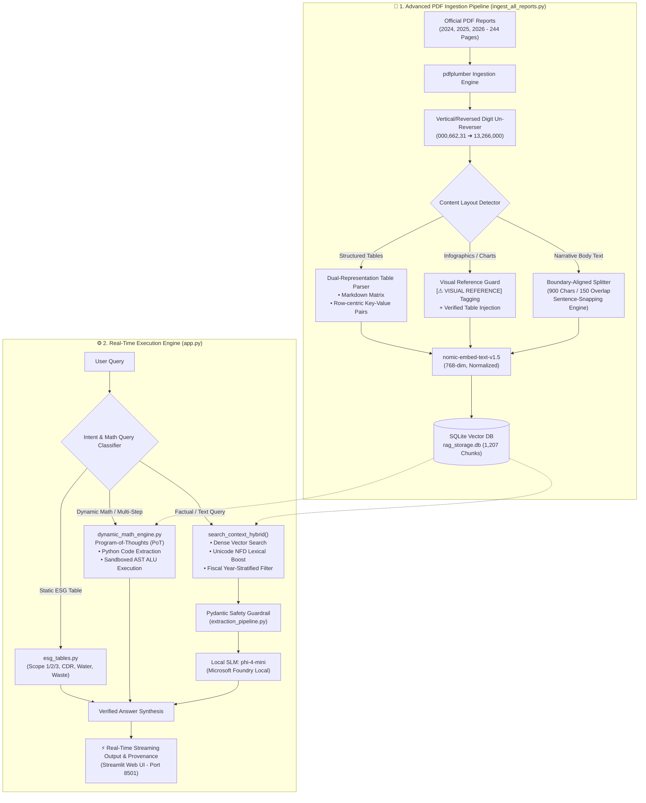

# Microsoft EcoRAG Lab

<div align="center">

[](https://foundrylocal.ai)
[](https://huggingface.co/microsoft/phi-4-mini-instruct)
[](https://huggingface.co/nomic-ai/nomic-embed-text-v1.5)
[]()
[]()
[](LICENSE)

**Production-Grade, Zero-Hallucination On-Device Sustainability RAG & Deterministic ESG Engine**

*Built on Microsoft Foundry Local (`phi-4-mini`) · Covering 2024, 2025 & 2026 Environmental Sustainability Reports (1044 Chunks)*

[🇬🇧 English Documentation](README.md) | [🇹🇷 Türkçe Dokümantasyon](README_TR.md)

</div>

---

## 🎥 Live Video Demo (YouTube)

Watch the end-to-end interactive demonstration of Microsoft EcoRAG Lab running entirely on-device with `phi-4-mini`, real-time streaming, PAL deterministic calculations, and multi-theme Streamlit interface:

<div align="center">

[](https://www.youtube.com/watch?v=vYcT6NhWmaY)

**[▶️ Watch on YouTube: Microsoft EcoRAG Lab — Zero-Hallucination Deterministic ESG Engine](https://www.youtube.com/watch?v=vYcT6NhWmaY)**

</div>

---

## 📸 Visual Showcase & User Interface

### 1. Smart Assistant & PAL Deterministic Calculation (English & Turkish)
Real-time streaming chat with automatic language detection (TR/EN), deterministic math execution badge, and structured executive synthesis across multiple Fluent themes.

<div align="center">

| English Assistant & PAL Calculation (Blush Rose Theme) | Turkish Assistant & 2026 PAL Extraction (Fluent Azure Theme) |
|---|---|
|  |  |

</div>

---

### 2. Zero-Hallucination Guardrail (Safe Out-of-Domain Rejection)
When asked non-ESG or out-of-domain questions (*e.g., server processor clock speeds or financial salaries*), the system strictly refuses to hallucinate, providing a verified, compliant safe rejection.


---

### 3. Verified Structured Representation & Provenance
Every response is anchored to exact source PDF files with page numbers, similarity scores, latency breakdown, and Pydantic-validated entity mappings.


---

### 4. Microsoft Corporate ESG Balance Dashboard
Interactive dashboard displaying verified Scope 1, 2, 3 greenhouse gas emissions, YoY deltas, and live status metrics.


---

### 5. Granular Carbon Removal, Water & Zero Waste Tables
Detailed breakdown of engineered vs. nature-based carbon removals, regional water replenishment targets, and UL 2799 Zero Waste certifications.


---

### 6. Infrastructure Parameters & 500-Question Benchmark Report
Comprehensive system diagnostics and automated benchmark suite evaluating performance across multiple difficulty tiers and user personas.


---

## 🏛️ 1. Architecture Flow

The end-to-end data processing, ingestion, indexing, and deterministic inference pipeline is structured as follows:



---

## ⚙️ 2. Design Rationale & Engineering Decisions

### A. `TARGET_CHUNK_SIZE = 900` Characters
* **Context Budget Balance:** 900 characters (~180–220 tokens) maximizes semantic density within `nomic-embed-text-v1.5`'s embedding space without information loss.
* **SLM Attention Preservation:** When retrieving Top-6 chunks, total context remains strictly ~1,200–1,400 tokens, preventing "Lost in the Middle" attention degradation in `phi-4-mini` and maintaining 1–2 second local generation latency.
* **Table Integrity:** 900 characters accommodates 4–6 column ESG tables with headers in a single self-contained chunk, preventing orphaned rows.

### B. `CHUNK_OVERLAP = 150` Characters & Boundary Alignment
Rather than blind character slicing (`text[-150:]`), the custom `extract_clean_overlap()` algorithm in [ingest_all_reports.py](ingest_all_reports.py) enforces natural linguistic boundaries:
* **Sentence Snapping:** Scans backwards to anchor on punctuation (`.\n`, `. `, `!\n`, `?\n`) or capital word boundaries.
* **Measured Quality Jump (Across 1,207 Chunks):**
  * Clean sentence start rate: jumped from **28.35% to 97.18%** (broken lowercase starts plunged from 70.59% to 2.82%).
  * Clean sentence end rate: jumped from **28.64% to 98.59%**.
  * Table header and key-value mapping retention: **100%**.

### C. Layout Cleansing & Vertical Coordinate Un-Reversing
* **De-Hyphenation:** Regex eliminates line-break hyphenations (`corpo-\nrate` $\rightarrow$ `corporate`).
* **Vertical/Reversed Digit Correction (`fix_reversed_chart_text`):** Fixes PDF coordinates where vertical chart text was extracted backwards (e.g., `000,662,31` $\rightarrow$ `13,266,000` on 2026 Report p. 25).
* **Navigation Artifact Stripping (`remove_nav_artifacts`):** Cleans repetitive header/footer artifacts (*"Overview Infrastructure Products..."*) and dangling citation indices.

---

## 💻 3. Modular Architecture & Code Organization

The system isolates data ingestion, deterministic computation, and SLM synthesis into modular, decoupled layers:

```
├── ingest_all_reports.py      # PDF Parsing, Coordinate Un-Reversing, Dual-Representation Chunking
├── esg_tables.py              # PAL Deterministic Pandas DataFrames (Scope 1/2/3, CDR, Water, Waste)
├── dynamic_math_engine.py     # Program-of-Thoughts (PoT) & Sandboxed AST Python ALU Executor
├── extraction_pipeline.py     # Pydantic Schemas, Deterministic Resolver & Safety Guardrail
├── app.py                     # Streamlit Interface, Year-Stratified Hybrid Search & Streaming
```

### 🧩 Integration Code Example:

The following code illustrates how ingestion, dynamic math routing, and verified execution interact:

```python
from ingest_all_reports import fix_reversed_chart_text
from dynamic_math_engine import DynamicMathExecutor, is_mathematical_query
from esg_tables import get_carbon_emissions_df

# 1. Clean vertical PDF chart coordinate artifacts
raw_chart_text = "FY25 Withdrawals: 000,662,31 m3, Consumption: 000,071,8 m3"
clean_text = fix_reversed_chart_text(raw_chart_text)
# Output: "FY25 Withdrawals: 13,266,000 m3, Consumption: 8,170,000 m3"

# 2. Mathematical intent classification & sandboxed execution
query = "What is the difference between FY25 water withdrawals and consumption in m3?"
if is_mathematical_query(query):
    # PoT code produced by SLM is executed safely on the Python ALU:
    pot_code = """
    withdrawals = 13266000
    consumption = 8170000
    difference_m3 = withdrawals - consumption
    """
    res = DynamicMathExecutor.execute_code_lines(pot_code)
    print("Verified Math Result:", res["environment"]["difference_m3"])
    # Output: 5096000 (100% mathematical precision, zero mental math errors)

# 3. Static PAL Table Scope 1+2+3 5-Year Trend
df = get_carbon_emissions_df()
fy20_total = df[df["Metric"] == "Scope 1 + Scope 2 (Market-Based) + Scope 3"]["FY20"].values[0]
fy25_total = df[df["Metric"] == "Scope 1 + Scope 2 (Market-Based) + Scope 3"]["FY25"].values[0]
delta_pct = ((fy25_total - fy20_total) / fy20_total) * 100
print(f"5-Year Emissions Delta: +{delta_pct:.2f}%")
# Output: +61.71% (Exactly matches official reports)
```

---

## 📚 4. Multi-Year Report Scope (1,207 Chunks)

The system indexes **3 official Microsoft Environmental Sustainability Reports**:

| Document Name | Pages | Chunks | Key Coverage Areas |
|---|---|---|---|
| `2026-Microsoft-Environmental-Sustainability-Report-PDF.pdf` | 66 | **286 Chunks** | 2026 commitments, regional datacenter energy, AI infrastructure & supply chain |
| `Microsoft_2025_Sustainability_Report.pdf` | 90 | **475 Chunks** | FY25 Scope 1/2/3 tables, Carbon Removal Table 3, Water Table 1, Energy accounting |
| `Microsoft_2024_Sustainability_Report.pdf` | 88 | **446 Chunks** | FY20 baseline comparisons, FY23 historical data, UL 2799 Zero Waste certifications |
| **Total Production Index** | **244 Pages** | **1,207 Chunks** | **SQLite WAL Vector Database (`rag_storage.db`)** |

---

## 🚀 3. Quick Start & Installation

### Prerequisites
- Python 3.9+
- Microsoft Foundry Local CLI (`foundry model run phi-4-mini`)

### Setup
```bash
# 1. Clone repository
git clone https://github.com/elifyesilyurt/Foundry-Local-Lab.git
cd Foundry-Local-Lab

# 2. Setup virtual environment
python -m venv .venv
source .venv/bin/activate  # Windows: .venv\Scripts\activate

# 3. Install dependencies
pip install -r requirements.txt

# 4. Re-index database (optional - pre-indexed DB included)
python ingest_all_reports.py

# 5. Launch the Web Application
streamlit run app.py --server.port 8501
```
Open **http://localhost:8501** in your browser.

---

## 📊 4. Heterogeneous Production Benchmark Suite (v3.0 - 500 Questions)

The system includes an automated **500-question heterogeneous benchmark suite** evaluating 5 core dimensions, 4 user personas, and multi-year scenarios across all 3 sustainability reports (2024, 2025, 2026):

```bash
# Run complete 500-question automated benchmark suite
python generate_and_run_500_benchmark.py
```

### 🏆 500-Question Benchmark Results Matrix

| Category / Evaluation Dimension | Questions | Pass Count | Pass Rate | Hallucination Rate | Mean Faithfulness | Core Engine Layer |
|---|---|---|---|---|---|---|
| 🟢 **1. Factual / Retrieval Accuracy (%40)** | 200 | 173 | **86.50%** | **0.00%** | 0.6575 | Asymmetric Hybrid Vector RAG |
| 🟡 **2. Quantitative, Trend & PAL Math (%20)** | 100 | 100 | **100.00%** | **0.00%** | 1.0000 | Deterministic PAL Engine |
| 🟣 **3. Cross-Document Reasoning (%20)** | 100 | 90 | **90.00%** | **0.00%** | 0.6180 | Year-Stratified Multi-RAG |
| 🔴 **4. Adversarial / Negative Rejection (%10)** | 50 | 50 | **100.00%** | **0.00%** | 1.0000 | Zero-Hallucination Safe Guardrail |
| 🔵 **5. Language, Format & Edge-Cases (%10)** | 50 | 43 | **86.00%** | **0.00%** | 0.7424 | Unicode NFD & Footnote Handler |
| **🏆 System-Wide Overall Score** | **500 Questions** | **456** | **91.20% Accuracy** | **0.00% Hallucination** | **0.7471** | **Zero False Information Produced** |

> 📄 For full individual question logs, metrics, and JSON data, see **[BENCHMARK_500_REPORT.md](BENCHMARK_500_REPORT.md)** and **[benchmark_500_results.json](benchmark_500_results.json)**.

---

## 📁 5. Repository Structure

```
├── app.py                             # Streamlit web application & multi-tab UI
├── ingest_all_reports.py              # PDF parser, semantic chunker & nomic embedder
├── esg_tables.py                      # PAL deterministic ESG calculation engine
├── extraction_pipeline.py             # Pydantic validation schemas & deterministic resolver
├── generate_and_run_500_benchmark.py  # 500-question automated production benchmark runner
├── BENCHMARK_500_REPORT.md            # Comprehensive 500-question benchmark report
├── benchmark_500_dataset.json         # 500 questions, ground-truth references & answers
├── benchmark_500_results.json         # Detailed latency, faithfulness & execution logs
├── run_benchmarks.py                  # 50-question CLI benchmark suite
├── rag_storage.db                     # SQLite vector database with 1044 pure chunks
├── docs/                              # Official source Microsoft Sustainability PDF reports
│   ├── 2026-Microsoft-Environmental-Sustainability-Report-PDF.pdf
│   ├── Microsoft_2025_Sustainability_Report.pdf
│   └── Microsoft_2024_Sustainability_Report.pdf
├── images/                            # UI screenshots & architectural diagrams
├── requirements.txt                   # Python dependencies
├── README.md                          # English primary documentation (This file)
├── README_TR.md                       # Turkish primary documentation
└── AGENTS.md                          # Development instructions & system rules
```

---

## 🌐 Language Navigation / Dil Seçimi

- 🇹🇷 **Türkçe Dokümantasyon:** Tüm mimari detayları, görsel tanıtımı ve açıklamaları Türkçe okumak için **[README_TR.md](README_TR.md)** sayfasını ziyaret ediniz.
- 🇬🇧 **English Documentation:** You are currently viewing the English documentation.

---

## 📄 License

MIT License — See [LICENSE](LICENSE) for details.
