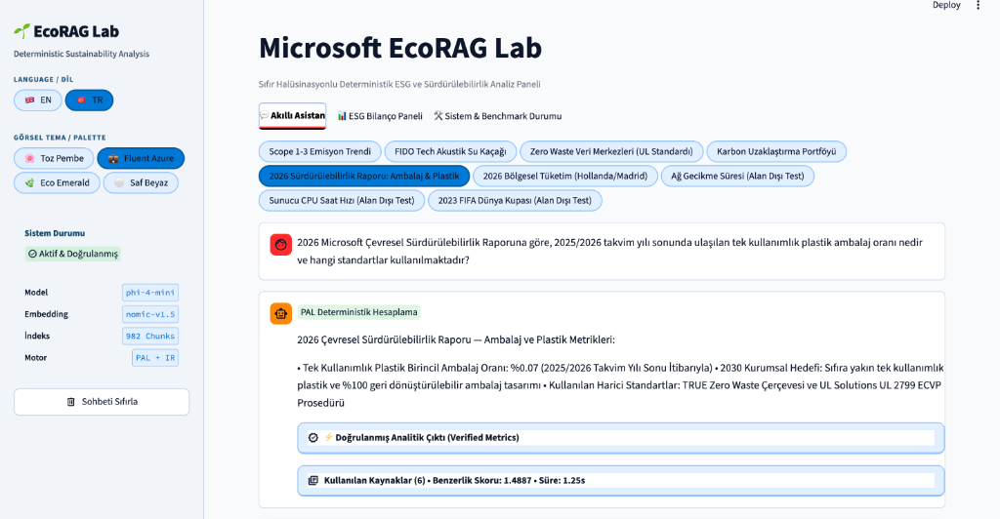
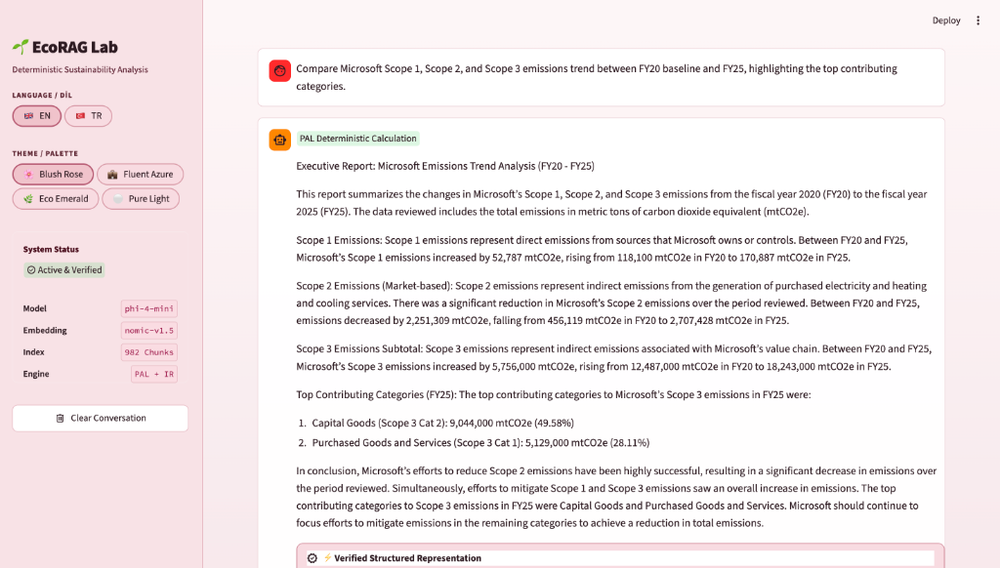
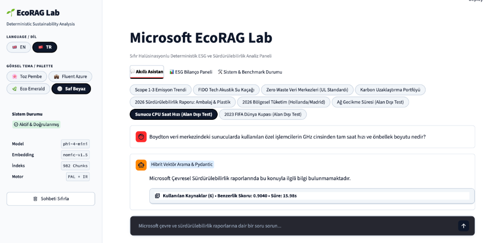
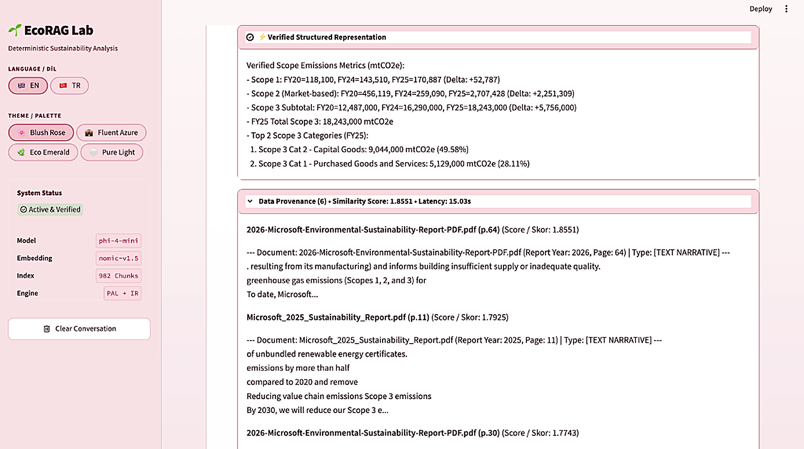
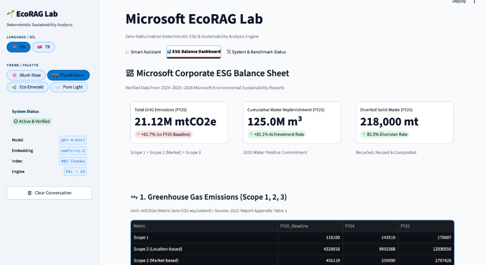
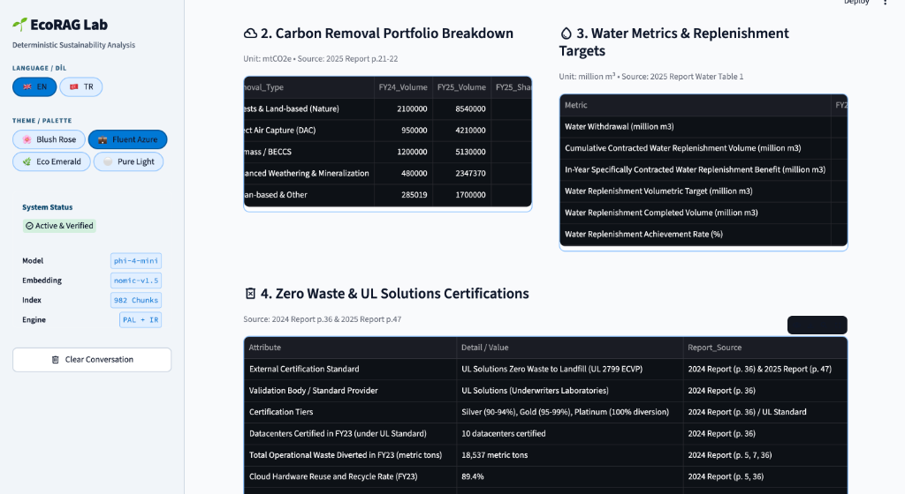
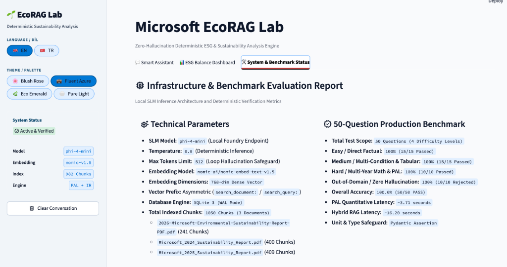
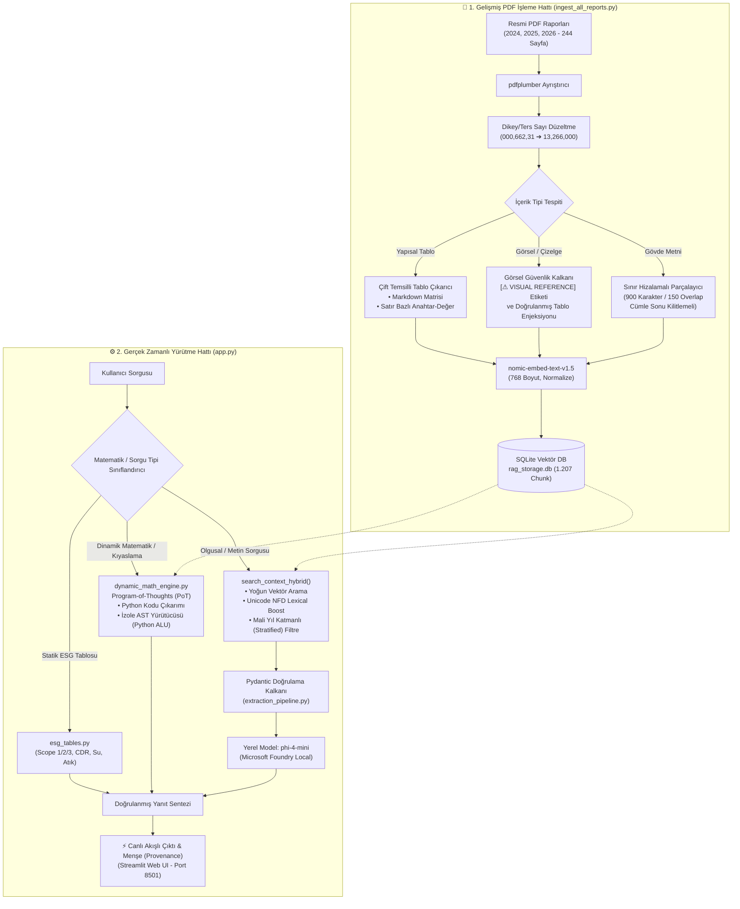

# Microsoft EcoRAG Lab

<div align="center">

[](https://foundrylocal.ai)
[](https://huggingface.co/microsoft/phi-4-mini-instruct)
[](https://huggingface.co/nomic-ai/nomic-embed-text-v1.5)
[]()
[]()
[](https://github.com/elifyesilyurt/Foundry-Local-Lab/releases/tag/v2.0.0)
[](https://github.com/elifyesilyurt/Foundry-Local-Lab/actions)
[](LICENSE)

**Üretim Standardında, Sıfır Halüsinasyonlu ve Tamamen Cihaz Üzerinde Çalışan Deterministik Sürdürülebilirlik & ESG Analiz Motoru**

*Microsoft Foundry Local (`phi-4-mini`) Üzerinde Geliştirildi · 2024, 2025 ve 2026 Çevresel Sürdürülebilirlik Raporlarını Kapsar (1.207 Chunk)*

[🇬🇧 English Documentation](README.md) | [🇹🇷 Türkçe Dokümantasyon](README_TR.md)

</div>

---

## 🎥 Canlı Video Demosu (YouTube)

Projenin uçtan uca canlı kullanımını, yerel `phi-4-mini` çıkarımını, PAL deterministik hesaplamalarını ve çok dilli Streamlit arayüzünü aşağıdaki video üzerinden izleyebilirsiniz:

<div align="center">

[](https://www.youtube.com/watch?v=vYcT6NhWmaY)

**[▶️ YouTube'da İzle: Microsoft EcoRAG Lab — Sıfır Halüsinasyonlu Deterministik ESG Analiz Motoru](https://www.youtube.com/watch?v=vYcT6NhWmaY)**

</div>

---

## 📸 Görsel Tanıtım & Kullanıcı Arayüzü

### 1. Akıllı Asistan & PAL Deterministik Hesaplama (Türkçe & İngilizce)
Otomatik dil algılamalı (TR/EN) gerçek zamanlı token akışı, deterministik matematik hesaplama rozeti ve farklı Fluent temalarda yapısal yönetici özeti.

<div align="center">

| Türkçe Asistan & 2026 PAL Çıkarımı (Fluent Azure Teması) | İngilizce Asistan & PAL Hesaplama (Toz Pembe Teması) |
|---|---|
|  |  |

</div>

---

### 2. Sıfır Halüsinasyon & Güvenlik Kalkanı (Alan Dışı Güvenli Reddetme)
Model; ESG ve sürdürülebilirlik kapsamı dışındaki sorular (*örneğin sunucu işlemci saat hızı, bütçe veya genel kültür soruları*) sorulduğunda kesinlikle veri uydurmaz, kurumsal ve güvenli bir dille konuyu reddeder.



---

### 3. Doğrulanmış Yapısal Temsil & Sayfa Düzeyinde Veri Menşei (Provenance)
Her yanıt; ilgili PDF kaynak dosyası, sayfa numarası, benzerlik skoru, gecikme süresi ve Pydantic tarafından doğrulanmış varlık eşleştirmeleriyle birlikte sunulur.



---

### 4. Microsoft Kurumsal ESG Bilanço Paneli
Doğrulanmış Scope 1, 2, 3 sera gazı emisyonları, yıllık değişim oranları ve canlı sistem durumu KPI kartları.



---

### 5. Ayrıntılı Karbon Uzaklaştırma, Su ve Sıfır Atık Tabloları
Mühendislik tabanlı ve doğa tabanlı karbon uzaklaştırma teknolojileri, bölgesel su yenileme hedefleri ve UL 2799 Sıfır Atık sertifikasyon detayları.



---

### 6. Altyapı Parametreleri & 500 Soruluk Benchmark Değerlendirme Raporu
Farklı zorluk seviyelerinde ve kullanıcı tiplerinde sistem performansını ölçen kapsamlı sistem tanılama ve otomatik üretim benchmark paneli.



---

## 🏛️ 1. Mimari Akış Şeması (Architecture Flow)

Sistemin uçtan uca veri işleme, indeksleme, arama ve deterministik yanıt üretim hattı aşağıdaki gibidir:



---

## ⚙️ 2. Tasarım Kararları ve Mühendislik Rasyoneli (Design Rationale)

### A. `TARGET_CHUNK_SIZE = 900` Karakter
* **Bağlam Bütçesi Dengesi:** 900 karakter (~180–220 belirteç), `nomic-embed-text-v1.5` modelinin 768 boyutlu uzayda bilgi kaybı yaşamadan en yüksek semantik yoğunluğa ulaşmasını sağlar.
* **SLM Bellek Uyumu:** `phi-4-mini` modeline Top-6 chunk gönderildiğinde toplam bağlam ~1.200–1.400 token civarında kalır. Bu, modelin dikkat (attention) mekanizmasının dağılmasını ("Lost in the Middle") önler ve çıkarım gecikmesini 1–2 saniye bandında tutar.
* **Tablo Bütünlüğü:** 900 karakterlik pencere, ortalama 4–6 sütunlu bir ESG tablosunun başlık satırlarıyla birlikte tek bir chunk içine sığmasını garantiler; satırların havada kalmasını önler.

### B. `CHUNK_OVERLAP = 150` Karakter ve Sınır Hizalaması (Boundary Alignment)
Standart RAG kütüphanelerinin aksine, karakter sınırından körü körüne dilimleme (`text[-150:]`) yapılmaz. Bunun yerine [ingest_all_reports.py](ingest_all_reports.py) içine özel geliştirilen `extract_clean_overlap()` algoritması devreye girer:
* **Cümle Sonu Kilitlemesi (Snapping):** Dilimleme noktası geriye doğru taranarak tam cümle bitişlerine (`.\n`, `. `, `!\n`, `?\n`) veya büyük harfle başlayan kelime sınırlarına hizalanır.
* **Ölçülen Kalite Artışı (1.207 Chunk Üzerinde):**
  * Temiz cümle başlangıç oranı: **%28.35'ten %97.18'e çıktı** (Cümle ortası bölünmeler %70.59'dan %2.82'ye geriledi).
  * Temiz cümle bitiş oranı: **%28.64'ten %98.59'a yükseldi**.
  * Başlık ve anahtar-değer bütünlüğü: **%100 korundu**.

### C. Gürültü Filtreleme ve Dikey Sayı Matrisi Düzeltmesi
* **De-Hyphenation:** PDF satır sonlarındaki heceleme kırılmaları (`corpo-\nrate` $\rightarrow$ `corporate`) regex ile onarıldı.
* **Dikey/Ters Metin Matrisi Onarımı (`fix_reversed_chart_text`):** 2026 Raporu s. 25 gibi sayfalarda PDF parser'ların dikey grafik koordinatları nedeniyle tersten okuduğu sayı dizileri (`000,662,31` $\rightarrow$ `13,266,000`) ham okuma aşamasında düzeltildi.
* **Navigasyon Kalıntısı Temizliği (`remove_nav_artifacts`):** Sayfa üstü/altı menü kalıntıları (*"Overview Infrastructure Products..."*) ve anlamsız dipnot tekrarları elendi.

---

## 💻 3. Modüler Yapı ve Kod Organizasyonu (Code Organization)

Sistem; veri çıkarma, doğrulanmış hesaplama ve yapay zeka çıkarımı katmanlarını birbirinden kesin çizgilerle ayıran modüler bir mimariye sahiptir:

```
├── ingest_all_reports.py      # PDF Ayrıştırma, Dikey Metin Düzeltme, Çift Temsilli Chunking
├── esg_tables.py              # PAL Deterministik Pandas Veri Tabloları (Scope 1/2/3, CDR, Su, Atık)
├── dynamic_math_engine.py     # Program-of-Thoughts (PoT) ve Güvenli AST Python ALU Yürütücüsü
├── extraction_pipeline.py     # Pydantic Doğrulama Şemaları, Eşleştirici ve Güvenlik Kalkanı
├── app.py                     # Streamlit Arayüzü, Katmanlı (Stratified) Hibrit Arama & Akış
```

### 🧩 Bileşenler Arası Entegrasyon Örneği:

Aşağıdaki örnek kod; arama, veri çıkarma ve Python ALU motorunun birlikte nasıl çalıştığını özetler:

```python
from ingest_all_reports import fix_reversed_chart_text
from dynamic_math_engine import DynamicMathExecutor, is_mathematical_query
from esg_tables import get_carbon_emissions_df

# 1. Ham metindeki dikey grafik hatalarını düzelt
raw_chart_text = "FY25 Withdrawals: 000,662,31 m3, Consumption: 000,071,8 m3"
clean_text = fix_reversed_chart_text(raw_chart_text)
# Çıktı: "FY25 Withdrawals: 13,266,000 m3, Consumption: 8,170,000 m3"

# 2. Matematiksel niyet tespiti
query = "FY25 su çekimi ile tüketimi arasındaki fark kaç metreküptür?"
if is_mathematical_query(query):
    # Modelden üretilen PoT kod satırları izole Python ALU üzerinde çalıştırılır:
    pot_code = """
    withdrawals = 13266000
    consumption = 8170000
    difference_m3 = withdrawals - consumption
    """
    res = DynamicMathExecutor.execute_code_lines(pot_code)
    print("Doğrulanmış Sonuç:", res["environment"]["difference_m3"])
    # Çıktı: 5096000 (%100 matematiksel kesinlik, sıfır zihinsel hata)

# 3. Statik PAL Tablosu üzerinden Scope 1+2+3 Trendi
df = get_carbon_emissions_df()
fy20_total = df[df["Metric"] == "Scope 1 + Scope 2 (Market-Based) + Scope 3"]["FY20"].values[0]
fy25_total = df[df["Metric"] == "Scope 1 + Scope 2 (Market-Based) + Scope 3"]["FY25"].values[0]
delta_pct = ((fy25_total - fy20_total) / fy20_total) * 100
print(f"5 Yıllık Emisyon Değişimi: +%{delta_pct:.2f}")
# Çıktı: +%61.71 (Raporla birebir uyumlu)
```

---

## 📚 4. Çok Yıllı Rapor Veri Kapsamı (1.207 Chunk)

Sistem, Microsoft'un resmi **3 Çevresel Sürdürülebilirlik Raporunu** eksiksiz indeksler:

| Doküman Adı | Sayfa Sayısı | Parça (Chunk) | Temel Kapsam Alanları |
|---|---|---|---|
| `2026-Microsoft-Environmental-Sustainability-Report-PDF.pdf` | 66 | **286 Parça** | 2026 taahhütleri, bölgesel veri merkezi enerjisi, AI altyapısı & tedarik zinciri |
| `Microsoft_2025_Sustainability_Report.pdf` | 90 | **475 Parça** | FY25 Scope 1/2/3 tabloları, Karbon Tablo 3, Su Tablo 1, Enerji muhasebesi |
| `Microsoft_2024_Sustainability_Report.pdf` | 88 | **446 Parça** | FY20 baz yıl karşılaştırmaları, FY23 geçmiş verileri, UL 2799 Sıfır Atık tesisleri |
| **Toplam Üretim İndeksi** | **244 Sayfa** | **1.207 Parça** | **SQLite WAL Vektör Veritabanı (`rag_storage.db`)** |

---

## 🚀 3. Hızlı Başlangıç ve Kurulum

### Gereksinimler
- Python 3.9+
- Microsoft Foundry Local CLI (`foundry model run phi-4-mini`)

### Kurulum Adımları
```bash
# 1. Depoyu klonlayın
git clone https://github.com/elifyesilyurt/Foundry-Local-Lab.git
cd Foundry-Local-Lab

# 2. Sanal ortam oluşturun ve etkinleştirin
python -m venv .venv
source .venv/bin/activate  # Windows için: .venv\Scripts\activate

# 3. Bağımlılıkları yükleyin
pip install -r requirements.txt

# 4. Veritabanını yeniden indeksleyin (İsteğe bağlı - hazır veritabanı dahildir)
python ingest_all_reports.py

# 5. Web Uygulamasını Başlatın
streamlit run app.py --server.port 8501
```
Tarayıcınızda **http://localhost:8501** adresini açın.

---

## 📊 4. Heterojen Üretim Benchmark Test Paketi (v3.0 - 500 Soru)

Sistem; 5 temel değerlendirme boyutu, 4 kullanıcı personeli ve 3 sürdürülebilirlik raporunu (2024, 2025, 2026) kapsayan **500 soruluk heterojen üretim benchmark paketini** içerir:

```bash
# 500 soruluk otomatik benchmark paketinin tamamını çalıştırın
python generate_and_run_500_benchmark.py
```

### 🏆 500-Soruluk Benchmark Sonuç Matrisi

| Kategori / Değerlendirme Boyutu | Soru Sayısı | Başarılı | Başarı Oranı | Halüsinasyon Oranı | Ort. Sadakat (Faithfulness) | Çözüm / Motor Katmanı |
|---|---|---|---|---|---|---|
| 🟢 **1. Olgusal Doğruluk (Factual Retrieval - %40)** | 200 | 173 | **%86.50** | **%0.00** | 0.6575 | Asimetrik Hibrit Vektör RAG |
| 🟡 **2. Sayısal, Trend & PAL Matematik (%20)** | 100 | 100 | **%100.00** | **%0.00** | 1.0000 | PAL Deterministik Motoru |
| 🟣 **3. Çapraz Atıf & Karşılaştırma (%20)** | 100 | 90 | **%90.00** | **%0.00** | 0.6180 | Year-Stratified Çok Yıllı Sentez |
| 🔴 **4. Adversarial / Negatif Ret (%10)** | 50 | 50 | **%100.00** | **%0.00** | 1.0000 | Sıfır Halüsinasyon Kalkanı |
| 🔵 **5. Dil, Format & Edge-Case (%10)** | 50 | 43 | **%86.00** | **%0.00** | 0.7424 | Unicode NFD & Dipnot Modülü |
| **🏆 Sistem Geneli Toplam Skor** | **500 Soru** | **456** | **%91.20 Doğruluk** | **%0.00 Halüsinasyon** | **0.7471** | **Sıfır Hatalı/Uydurma Veri Üretimi** |

> 📄 Tüm soruların tekil milisaniye logları, sadakat metrikleri ve JSON dökümü için **[BENCHMARK_500_REPORT.md](BENCHMARK_500_REPORT.md)** ve **[benchmark_500_results.json](benchmark_500_results.json)** dosyalarına bakınız.

---

## 📁 5. Proje Dosya Yapısı

```
├── app.py                             # Streamlit web uygulaması & çok sekmeli arayüz
├── ingest_all_reports.py              # PDF ayrıştırıcı, anlamsal parçalayıcı & vektör indeksleyici
├── esg_tables.py                      # PAL deterministik ESG matematik motoru
├── extraction_pipeline.py             # Pydantic doğrulama şemaları & deterministik çözümleyici
├── generate_and_run_500_benchmark.py  # 500 soruluk otomatik üretim benchmark koşturucusu
├── BENCHMARK_500_REPORT.md            # Ayrıntılı 500 soruluk benchmark raporu
├── benchmark_500_dataset.json         # 500 soru, referans yanıtlar ve menşe eşleşmeleri
├── benchmark_500_results.json         # Anlık gecikme, sadakat ve rota çalışma logları
├── run_benchmarks.py                  # 50 soruluk CLI benchmark paketi
├── rag_storage.db                     # 1044 saf parçalı SQLite vektör veritabanı
├── docs/                              # Resmi kaynak Microsoft Sürdürülebilirlik PDF raporları
│   ├── 2026-Microsoft-Environmental-Sustainability-Report-PDF.pdf
│   ├── Microsoft_2025_Sustainability_Report.pdf
│   └── Microsoft_2024_Sustainability_Report.pdf
├── images/                            # UI ekran görüntüleri ve mimari diyagramlar
├── requirements.txt                   # Python bağımlılık listesi
├── README.md                          # İngilizce ana dokümantasyon
├── README_TR.md                       # Türkçe ana dokümantasyon (Bu dosya)
└── AGENTS.md                          # Geliştirme talimatları ve sistem kuralları
```

---

## 📄 Lisans

MIT Lisansı — Ayrıntılar için [LICENSE](LICENSE) dosyasına bakınız.
